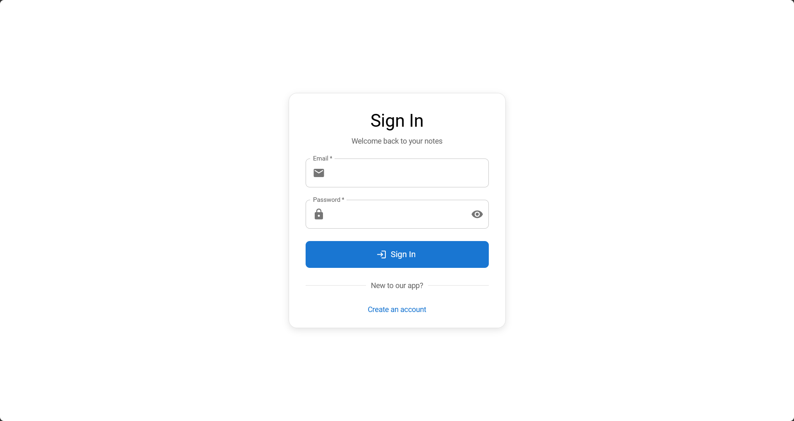
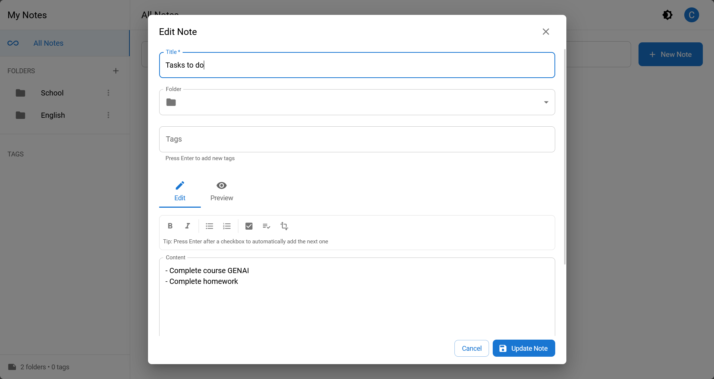
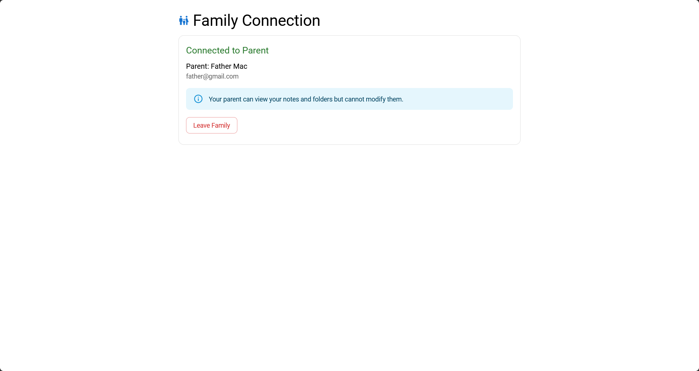

# Note-Taking App

A full-stack note-taking application for families, supporting parent/child roles, secure authentication, folder and note organization, and a modern React UI.

---

## 🚀 Overview

This project is designed to help families organize notes, tasks, and information securely. Parents can view their children's notes, while children can create and manage their own notes and folders. The app features robust authentication, family management via unique codes, and a responsive, themeable interface.

---

## 🎯 Aim & Use Case

- **Aim:** Provide a secure, organized, and collaborative note-taking environment for families.
- **Use Case:** Parents monitor and organize children's notes, children manage their own notes and folders, all within a private family group.

---

## 🧩 Features

- **User Roles:** Parent (read-only view of children's notes), Child (create/edit notes and folders)
- **Authentication:** JWT-based signup/signin, role-based access
- **Family Management:** Unique family codes for linking parent/child accounts
- **Notes:** Markdown-style notes, checklists, tags, folder organization
- **Folders:** Nested folders, CRUD operations
- **Dashboard:** Responsive UI, dark/light theme toggle, sidebar navigation
- **Tech Stack:** FastAPI (Python), MongoDB, React, Vite, Material UI

---

## 🏗️ Architecture


---

## 🖼️ UI Walkthrough

> **Tip:** To add screenshots, place image files in `frontend/public/` and reference them below using Markdown:  
> ``

### 1. Sign In / Sign Up

- User authentication for parent/child roles.
-  <!-- Replace with actual screenshot -->
-  <!-- Replace with actual screenshot -->

### 2. Dashboard

- Sidebar navigation for folders and notes.
- Responsive layout, dark/light theme toggle.
-  <!-- Replace with actual screenshot -->

### 3. Note Editor

- Markdown editing, checklist support, tag management, folder assignment.
-  <!-- Replace with actual screenshot -->

### 4. Family Management

- Parent dashboard for family code generation, child linking, and viewing children.
-  <!-- Replace with actual screenshot -->

---

## ⚙️ Backend

- **Framework:** FastAPI
- **Database:** MongoDB
- **Endpoints:** `/auth`, `/notes`, `/folders`, `/family`, `/tags`, `/users`
- **Models:** User, Folder, Note, FamilyCode
- **Config:** Environment variables in `.env` (see `.gitignore`)
- **Requirements:** See [`backend/requirements.txt`](backend/requirements.txt:1)

### Setup

```bash
cd backend
python -m venv venv
source venv/bin/activate  # Windows: venv\Scripts\activate
pip install -r requirements.txt
# Create .env file with MONGO_URI and SECRET_KEY
uvicorn main:app --reload
```

---

## ⚛️ Frontend

- **Framework:** React + Vite
- **UI:** Material UI
- **State:** Context API (Auth, Theme, Folder)
- **Routing:** React Router

### Setup

```bash
cd frontend
npm install
npm run dev
```

---

## 🌐 Environment

- **Backend:** Python 3.10+, MongoDB
- **Frontend:** Node.js 18+, npm
- **Config:** `.env` files for secrets and DB URI

---

## 📖 Usage

1. **Start Backend:** Run FastAPI server (see above)
2. **Start Frontend:** Run React dev server (see above)
3. **Access App:** Open [http://localhost:5173](http://localhost:5173)
4. **Sign Up:** Register as parent or child, link accounts via family code
5. **Create Notes/Folders:** Children can create/edit, parents have read-only access